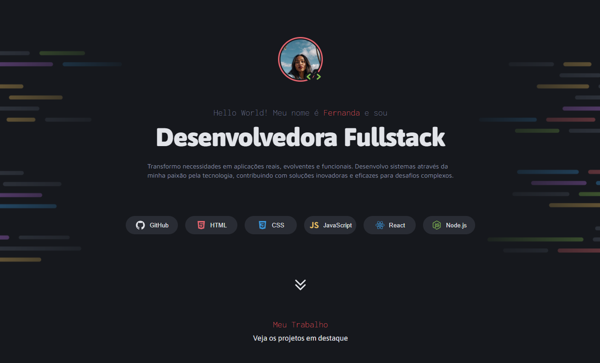

# 🌟 Portfólio de Desenvolvedor 🌟

## 📸 Preview

Aqui você pode adicionar uma imagem de preview do projeto para dar aos visitantes uma visão geral do layout e design. Para adicionar a imagem, salve-a no diretório do projeto e atualize o caminho da imagem abaixo:

O objetivo deste projeto é reunir todos os projetos feitos na trilha de aprendizagem full stack da Rocketseat. Ele possui links para minhas redes sociais e para a visualização de cada projeto realizado hospedado na plataforma Vercel.

## 🛠️ Tecnologias Utilizadas

- HTML5
- CSS3 (Flexbox e Grid)
- JavaScript (se aplicável)
- Fontes do Google Fonts

## 📂 Estrutura do Projeto

### HTML

O HTML está organizado de forma semântica utilizando tags como `<header>`, `<main>`, `<section>`, `<article>`, e `<footer>`, garantindo acessibilidade e SEO.

### CSS

O CSS é dividido em diferentes arquivos para melhor organização:
- **global.css**: Contém reset de estilo, variáveis e estilos globais.
- **header.css**: Estilos específicos para o cabeçalho.
- **main.css**: Estilos específicos para o conteúdo principal.
- **sections.css**: Estilos específicos para seções distintas.
- **footer.css**: Estilos específicos para o rodapé.

## 🎨 Funcionalidades

- Exibição de imagem de perfil e introdução.
- Seção de linguagens e ferramentas utilizadas.
- Cards de projetos com imagens e descrições.
- Links para redes sociais com ícones personalizados.
- Efeito de hover para interatividade.

## 🤝 Contribuindo

Sinta-se à vontade para contribuir com este projeto! Envie um pull request ou abra uma issue com suas ideias e melhorias.

## 📞 Contato

- **Email**: [fmenezes098@gmail.com](mailto:fmenezes098@gmail.com)
- **LinkedIn**: [Fernanda Menezes Ribeiro](https://www.linkedin.com/in/fernanda-menezes-ribeiro/)

---

